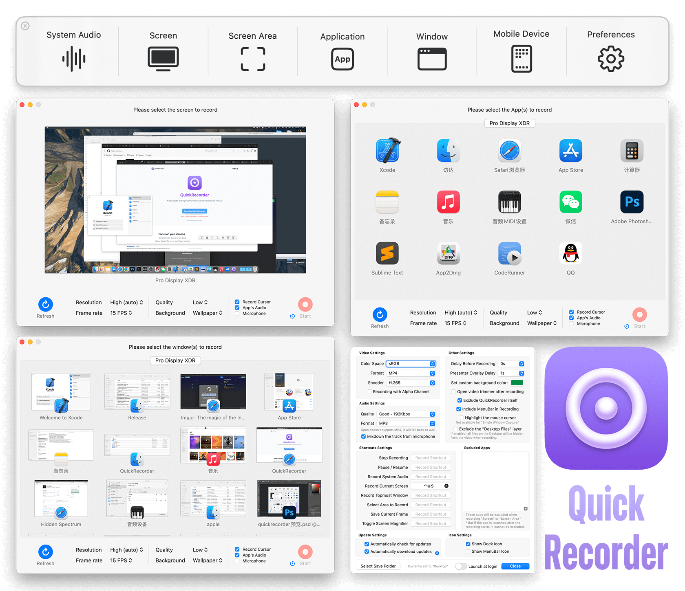

#
<p align="center">

<h1 align="center">QuickRecorder</h1>
<h3 align="center">A lightweight and high-performance screen recorder for macOS<br><a href="./README_zh.md">[中文版本]</a><br><a href="https://lihaoyun6.github.io/quickrecorder/">[Landing Page]</a>
</p>

## Updates by Andrew


### Change 1: Improve encoding quality 

Improve image quality by targeting ~ 110 mbps for 3.5K30 recording. Image quality increase is significant when recording HDR videos. 

Comparison: Both at Resolution: High, Quality: High

Previous setting 


New setting


### Frame rate

ScreenCaptureKit only delivers a new frame when something changes. Does not allow setting a fixed frame rate. Only allows throttling frame rate. https://developer.apple.com/documentation/screencapturekit/scstreamconfiguration/minimumframeinterval

Frame rate setting in app changes 2 things
1. ScreenCaptureKit source frame rate throttling
2. Video encoder expected frame rate

Tests on MBP 16 120Hz display
- 120 Hz content (120Hz FPS video in quicktime)
  - SCP no cap. Video encoder expect 60. Encoded 87

- 60 Hz content (Peru HDR on Chrome)
  - SCP no cap. Video encoder expect 120. Encoded 67. Little to no drops. Very good
  - SCP no cap. Video encoder expect 60. Encoded 67. Little to no drops. Very good
  - SCP cap 60. Video encoder expect 60. Encoded 57. More stutter


- 30 Hz content(RDR2 Youtube on Chrome https://youtu.be/Dnzuh6I8gnM?si=qbnhhImPl6Glawxx&t=319)
  - SCP no cap. Video encoder expect 30. Encoded 60. Almost no stutter, quite smooth
  - SCP cap 30. Video encoder expect 30. Encoded 29.4. Very significant stutter

### Change 2:

Remove SCP frame rate throttling for >= 60 FPS (labelled as 60+, 120+)
- Reduces chance of stutter. 
- VideoEncoder expected frame rate is set by the FPS setting

Tips for usage: Use 30 FPS if recording desktop, static items.

Use 60+ when recording anything moving, e.g. videos or games.
Don't use 30fps setting for 30fps games/videos

### Notes for building

Grant screen recording permissions to all new builds when building in xcode:
- in settings > privacy and security , delete previous permissions for QuickRecorder
- add QuickRecorder in Xcode build folder


### HDR support in alternative APIs
Screencapturekit seems to be the only API that has HDR support.
AVCaptureScreenInput and CGDisplayStream dont seem to support HDR (search for dynamic in Apple docs)


#

**Original readme continues below**

## Screenshot
<p align="center">
<picture>
  <source media="(prefers-color-scheme: dark)" srcset="./img/preview_en_dark.png">
  <source media="(prefers-color-scheme: light)" srcset="./img/preview_en.png">
  
</picture>
</p>

## Installation and Usage
### System Requirements:
- macOS 12.3 and Later

### Install:
Download the latest installation file [here](../../releases/latest) or install via Homebrew:

```bash
brew install lihaoyun6/tap/quickrecorder
```

### Features/Usage:
- You can use QuickRecorder to record your screens / windows / applications / mobile devices... etc.

- QuickRecorder supports driver-free audio loopback recording, mouse highlighting, screen magnifier and many more useful features.  
- The new **"[Presenter Overlay](https://support.apple.com/guide/facetime/presenter-overlay-video-conferencing-fctm6333f4bd/mac)"** in macOS 14 was fully supported by QuickRecorder, which can overlay the camera in real time on your recording *(macOS 12/13 can only use camera floating window)*  
- QuickRecorder is able to record `HEVC with Alpha` video format, that can contain alpha channel in the output file *(currently only iMovie and FCPX support this feature)*  

## Q&A
**1. Where can I reopen the main panel after closing it?**
> Click the Dock tile or Menubar icon of QuickRecorder to reopen the main panel at any time.

**2. Why does QuickRecorder not a sandbox app?**
> QuickRecorder has no plans to be uploaded to the App Store, so it does not need to be designed as a sandbox app.  

**3. How to independently control the volume of system sound and sound from microphone in other video editor?**
> QuickRecorder will merge the audio input from the microphone to the main audio track after recording by default. If you need to edit the video, you can turn off the `Record Microphone to Main Track` option in the settings panel. After turning off, the system sound and sound from microphone will be recorded into two audio tracks and can be edited independently.  

## Donate


## Thanks
[Azayaka](https://github.com/Mnpn/Azayaka) @Mnpn
> The source of inspiration and part of the code of the screen recording engine comes from the Azayaka project, and I am also one of the code contributors to this project

[KeyboardShortcuts](https://github.com/sindresorhus/KeyboardShortcuts) @sindresorhus  
> QuickRecorder uses this swift library to handle shortcut key events  

[SwiftLAME](https://github.com/hidden-spectrum/SwiftLAME) @Hidden Spectrum
> QuickRecorder uses this swift library to handle MP3 output

[ChatGPT](https://chat.openai.com) @OpenAI
> Note: Part of the code in this project was generated or refactored using ChatGPT.
