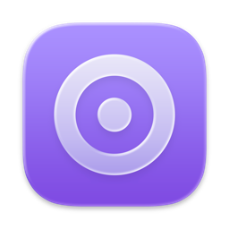

# 
<p align="center">

<h1 align="center">QuickRecorder</h1>
<h3 align="center">多功能、轻量化、高性能的 macOS 屏幕录制工具<br><a href="./README.md">[English Version]</a><br><a href="https://lihaoyun6.github.io/quickrecorder/">[软件主页]</a>
</p>

## 运行截图
<p align="center">
<picture>
  <source media="(prefers-color-scheme: dark)" srcset="./img/preview_dark.png">
  <source media="(prefers-color-scheme: light)" srcset="./img/preview.png">
  
</picture>
</p>

## 安装与使用
### 系统版本要求:
- macOS 12.3 及更高版本  

### 安装:
可[点此前往](../../releases/latest)下载最新版安装文件. 或使用homebrew安装:  

```bash
brew install lihaoyun6/tap/quickrecorder
```

### 特色 / 使用:
- 使用 SwiftUI 编写, 体积小巧轻量化. 软件大小仅有不到 10MB, 无任何累赘功能. 

- 支持窗口录制, App 录制, 录制移动设备等; 支持窗口声音内录, 鼠标高亮, 隐藏桌面文件等功能. 
- 完整支持 macOS 14 新增的 **[演讲者前置](https://support.apple.com/zh-cn/guide/facetime/fctm6333f4bd/mac)** 特性, 可在实时叠加摄像头画面 (低版本 macOS 可以使用悬浮窗模式).  
- 支持 `HEVC with Alpha` 特性, 可在输出文件中包含 Alpha 通道 (目前仅 iMovie 与 FCPX 支持此特性)
- 更多功能陆续开发中...  

## 常见问题
**1. 主面板关闭之后在哪里重新打开?**  
> 单击 QuickRecorder 的 Dock 栏图标即可随时重新呼出主功能面板.  

**2. 为什么 QuickRecorder 不是沙盒 App?**  
> 苹果沙盒权限管理机制比较复杂, 使用起来麻烦. 加之 QuickRecorder 并没有上架 App Store的打算, 故没有做成沙盒 App.

**3. 如何在后期剪辑中独立控制系统声音和麦克风录音的音量?**
> QuickRecorder 默认会在录制结束后将麦克风输入的音频合并到主音轨. 如果需要后期编辑的话, 可以在设置面板中关闭"将麦克风声音混缩至主音轨"选项. 关闭后系统声音和麦克风将分别录制为两条音轨, 可以独立编辑.  

## 赞助


## 致谢
[Azayaka](https://github.com/Mnpn/Azayaka) @Mnpn  
> 灵感来源以及屏幕录制引擎的部分代码来自于 Azayaka 项目, 同时我也是此项目的代码贡献者之一   

[KeyboardShortcuts](https://github.com/sindresorhus/KeyboardShortcuts) @sindresorhus  
> QuickRecorder 使用此swift库来处理快捷键事件  


[SwiftLAME](https://github.com/hidden-spectrum/SwiftLAME) @Hidden Spectrum
> QuickRecorder 使用此swift库来处理 MP3 输出

[ChatGPT](https://chat.openai.com) @OpenAI  
> 注: 本项目部分代码使用 ChatGPT 生成或重构整理
